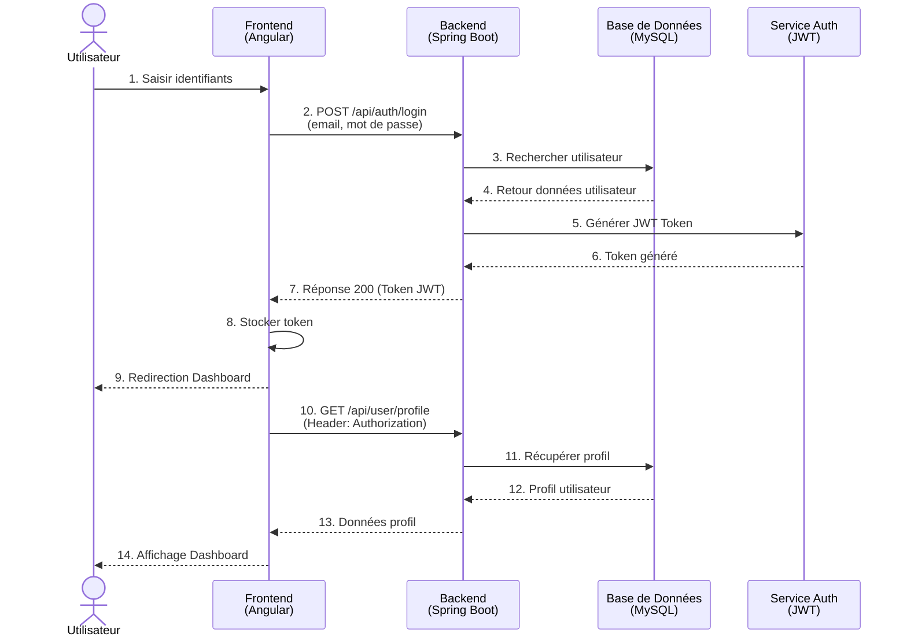
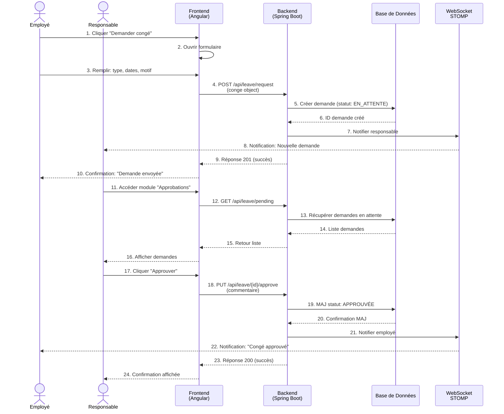
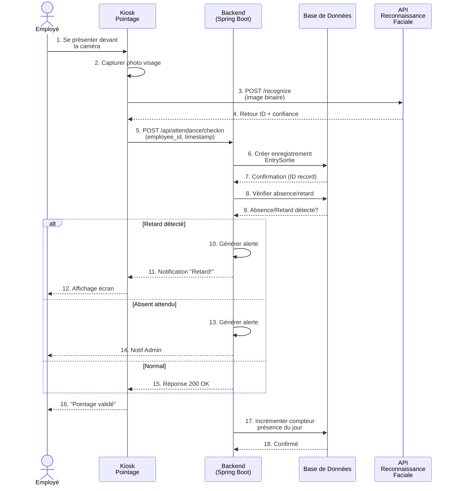
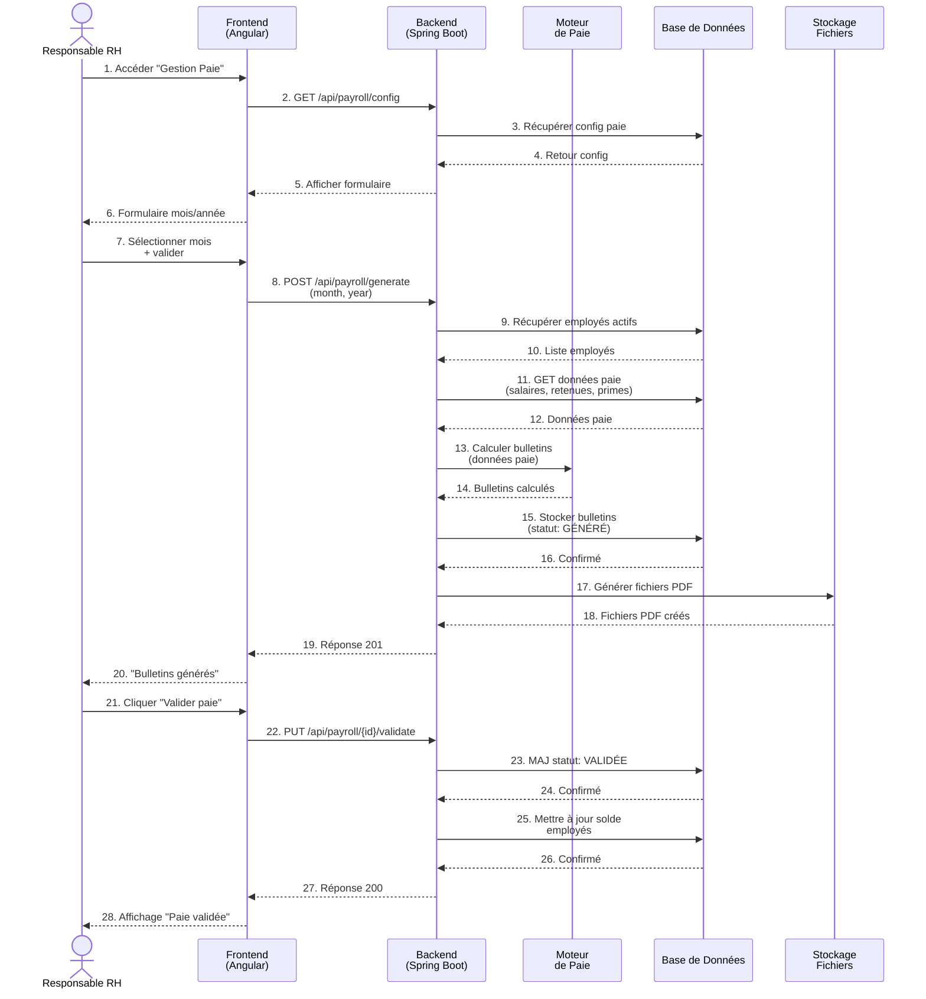
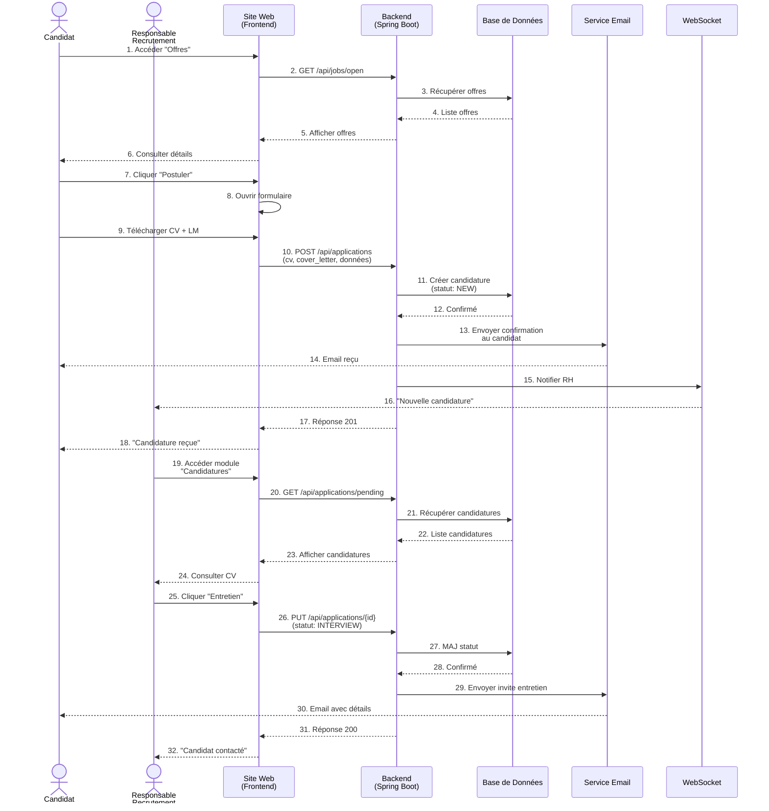
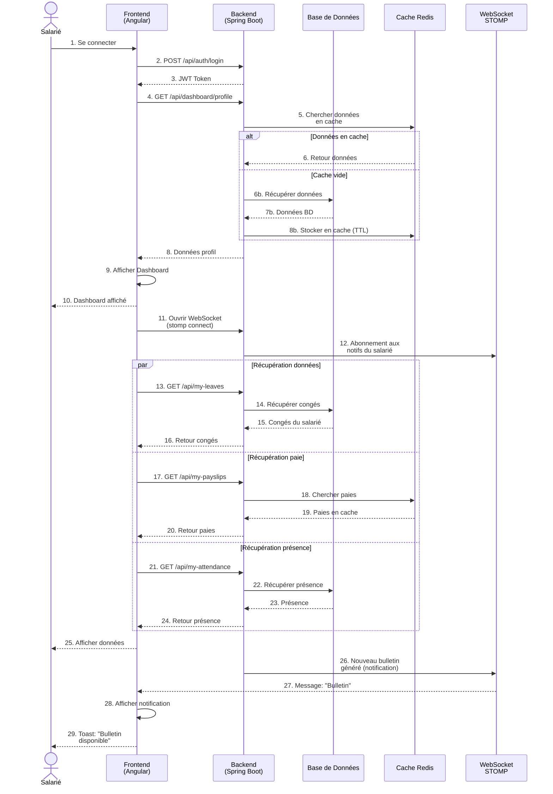
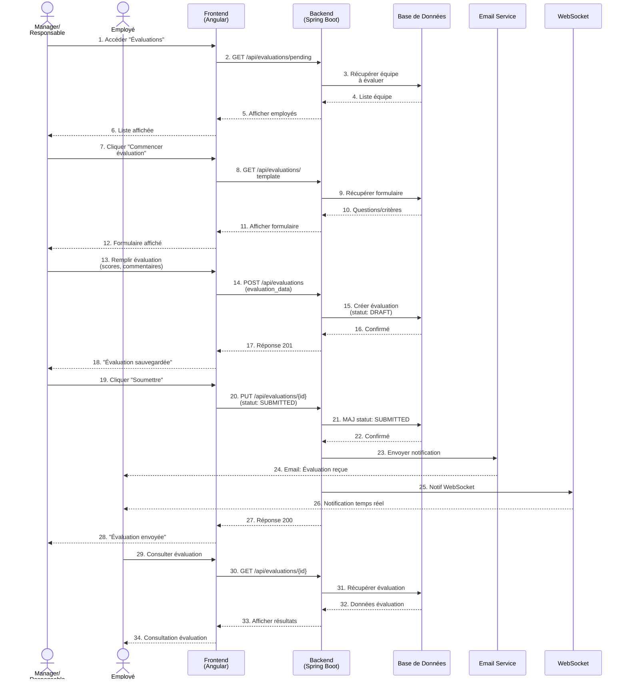

# Diagrammes de Séquences - SMART RH 4.0

## Vue d'ensemble
Ce document regroupe les diagrammes de séquence illustrant les interactions entre les différents composants du système SMART RH 4.0 pour les processus clés.

---

## 1. Authentification et Connexion

**Description :**
- L'utilisateur fournit ses identifiants
- Le backend valide les informations en base de données
- Un JWT token est généré pour les futures requêtes
- Le token est stocké côté client (localStorage)
- Le dashboard de l'utilisateur est chargé et affiché

**Endpoints impliqués :**
- `POST /api/auth/login` - Authentification
- `GET /api/user/profile` - Récupération du profil

---

## 2. Gestion des Congés avec Workflow d'Approbation

**Description :**
- L'employé remplit une demande de congé avec les dates et le type
- La demande est créée et le responsable reçoit une notification en temps réel
- Le responsable accède à la liste des demandes en attente
- Il peut approuver, rejeter ou demander des modifications
- L'employé reçoit une notification de la décision

**Endpoints impliqués :**
- `POST /api/leave/request` - Créer une demande
- `GET /api/leave/pending` - Récupérer demandes
- `PUT /api/leave/{id}/approve` - Approuver

---

## 3. Pointage par Reconnaissance Faciale

**Description :**
- L'employé se présente devant le kiosque
- Recognition faciale pour identifier l'employé
- Le pointage (check-in/check-out) est enregistré en base
- Détection automatique des retards ou absences
- Alertes générées pour les anomalies

**Endpoints impliqués :**
- `POST /api/attendance/checkin` - Pointage
- `GET /api/attendance/records` - Historique présence

---

## 4. Génération et Validation de la Paie

**Description :**
- Le responsable RH accède au module de gestion de paie
- Sélection du mois et de l'année
- Calcul automatique des bulletins selon les données (salaires, retenues, primes)
- Génération des fichiers PDF des bulletins
- Validation de la paie
- Mise à jour des soldes des employés

**Endpoints impliqués :**
- `GET /api/payroll/config` - Configuration paie
- `POST /api/payroll/generate` - Génération des bulletins
- `PUT /api/payroll/{id}/validate` - Validation paie
- `GET /api/payroll/export` - Export fichiers

---

## 5. Gestion du Recrutement

**Description :**
- Les candidats consultent les offres d'emploi
- Soumission de candidature avec CV et lettre de motivation
- Confirmation et notification au candidat
- Notification en temps réel au responsable RH
- RH accède aux candidatures et peut les progresser dans le pipeline
- Communication automatique par email avec les candidats

**Endpoints impliqués :**
- `GET /api/jobs/open` - Offres ouvertes
- `POST /api/applications` - Soumettre candidature
- `GET /api/applications/pending` - Candidatures en attente
- `PUT /api/applications/{id}` - Mettre à jour statut

---

## 6. Dashboard Employé avec Notifications Temps Réel

**Description :**
- L'employé se connecte et accède au dashboard
- Chargement des données avec utilisation du cache pour les performances
- Les données sont chargées en parallèle (congés, paie, présence)
- Ouverture d'une connexion WebSocket pour les notifications temps réel
- Affichage des notifications (ex: nouveau bulletin disponible)

**Points techniques :**
- Utilisation de **Redis** pour le cache
- Requêtes parallèles pour optimiser les performances
- **WebSocket/STOMP** pour les notifications en temps réel
- Temps de chargement optimisé (< 2 secondes objectif)

---

## 7. Gestion des Évaluations de Performance

**Description :**
- Le responsable accède à la liste des employés à évaluer
- Récupération du formulaire/template d'évaluation
- Remplissage avec scores et commentaires détaillés
- Sauvegarde en brouillon (DRAFT) puis soumission
- L'employé reçoit une notification (email + WebSocket)
- L'employé peut consulter son évaluation

**Endpoints impliqués :**
- `GET /api/evaluations/pending` - Évaluations en attente
- `GET /api/evaluations/template` - Récupérer le formulaire
- `POST /api/evaluations` - Créer une évaluation
- `PUT /api/evaluations/{id}` - Mettre à jour

---

## Synthèse des Technologies

| Composant | Technologie | Rôle |
|-----------|-------------|------|
| **Frontend** | Angular 17+ | Interface utilisateur |
| **Backend** | Spring Boot 3.2 | Logique métier |
| **BD** | MySQL 8.0 | Persistance des données |
| **Auth** | JWT + Spring Security 6 | Authentification & Autorisation |
| **Cache** | Redis | Optimisation performances |
| **Notifications** | WebSocket + STOMP | Temps réel |
| **Email** | Spring Mail | Notifications emails |

---

## Flux de Sécurité

Tous les diagrammes incluent les principes de sécurité suivants :
1. ✅ **JWT Token** - Authentification stateless
2. ✅ **Authorization header** - Sécurité des requêtes
3. ✅ **HTTPS/TLS** - Chiffrement en transit
4. ✅ **RGPD compliance** - Logs d'audit
5. ✅ **Role-Based Access Control (RBAC)** - Contrôle d'accès

---

**Document généré pour le projet SMART RH 4.0**  
**Version:** 1.0  
**Date:** Avril 2026
